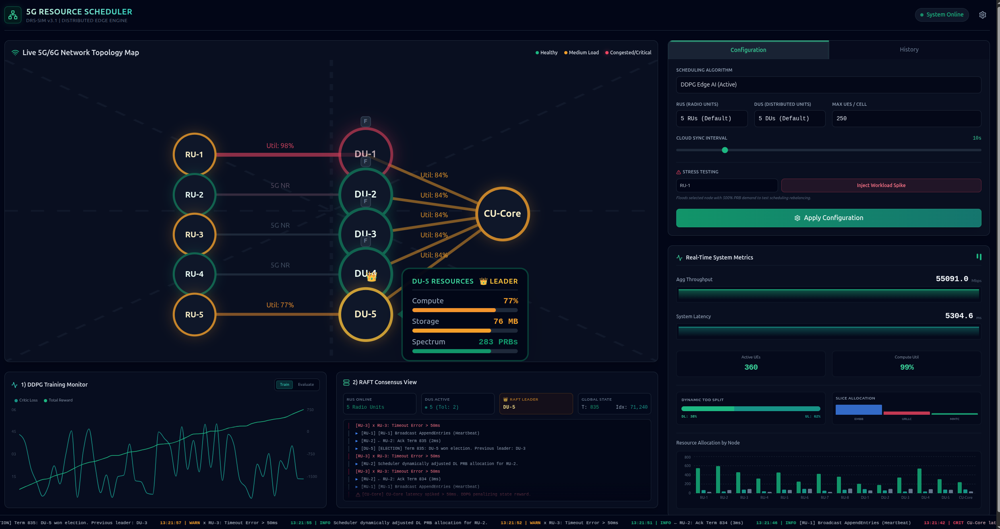
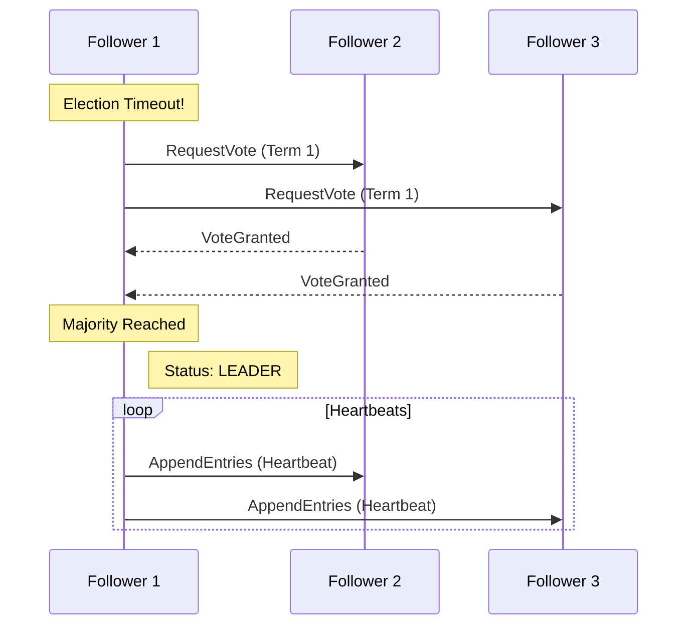

# Edge Scheduling Engine - 5G/6G Distributed Systems Final Project



This project implements core distributed systems concepts including consensus algorithms, deep reinforcement learning, big data analytics, and microservice architectures. 

## Major Components

1. **Custom Raft Consensus (`services/scheduler/cluster`)**
   A custom, dependency-free implementation of the Raft consensus algorithm. Redundant Edge Scheduler nodes dynamically elect a Leader, maintain heartbeats, and replicate network scheduling decisions to an internal distributed log for fault tolerance.
2. **DDPG Reinforcement Learning Agent (`services/scheduler/ml`)**
   A PyTorch Actor-Critic neural network that predicts optimal Downlink/Uplink TDD splits in real-time. It learns to minimize UE buffer starvation and maximize throughput across dynamic network conditions.
3. **Stateful 5G Base Station Simulator (`services/basestation-sim`)**
   A stateful, physics-based simulator modeling UE mobility (random walk), Path Loss mapping to SINR/CQI, and Poisson-distributed packet traffic. It dynamically drains 5G buffers by mathematical transmission capacity upon receiving Scheduler PRB allocations.
4. **Big Data PySpark Analytics (`services/analytics`)**
   A data pipeline that ingests gigabytes of centralized telemetry JSONL logs. It utilizes Apache Spark to execute tumbling time-window aggregations, isolating throughput demands per 5G network slice (eMBB, URLLC, mMTC). 
5. **Global Cloud Orchestrator (`services/cloud-orchestrator`)**
   A slow-loop orchestrator that reads historical PySpark analytics to detect slice starvation. It deploys new Quality of Service weights downward to the fast-loop Edge Schedulers via gRPC `UpdateSlicePolicy` hooks.
6. **React Dashboard Interface (`frontend`)**
   Features a live animated SVG Network Topology map, real-time DDPG training monitors, scrolling RAFT consensus logs, and responsive Recharts for bandwidth capabilities. It includes a dynamic configuration panel allowing users to independently scale the simulated Radio Access Network, supporting live topology shifts between 3 to 12 active Radio Units (RUs) and 3 to 9 active Distributed Units (DUs).

## O-RAN Architecture Overview

This simulator accurately models the decomposed 5G/6G Open Radio Access Network (O-RAN) architecture across three distributed tiers:
* **RU (Radio Unit):** Represent the physical antennas handling raw radio frequency (RF) signals and edge device connectivity.
* **DU (Distributed Unit):** Edge compute nodes placed near the RU that execute the real-time DDPG scheduling inferences (assigning spectrum blocks millisecond-by-millisecond).
* **CU (Centralized Unit):** Regional cloud nodes that manage slow-loop tasks, global quality-of-service policies, and broader network orchestration.

---

## Technology & Core Concepts

### Raft Consensus Algorithm
The Edge Scheduling Engine uses a custom implementation of the **Raft consensus algorithm** to ensure high availability and fault tolerance of the scheduler. In a distributed edge environment, if one scheduler node fails, the system must continue to make consistent decisions.

**Role of Raft:**
- **Leader Election:** Nodes dynamically elect a single "Leader" to handle all scheduling requests. If the leader fails, a new one is elected within milliseconds.
- **Log Replication:** Scheduling decisions (e.g., TDD splits, PRB allocations) are treated as log entries and replicated across the cluster.
- **Strong Consistency:** A decision is only considered "committed" and applied to the 5G simulator once a majority of nodes (quorum) have acknowledged it.

#### Leader Election Flow


### Deep Deterministic Policy Gradient (DDPG)
The scheduler utilizes a **DDPG (Actor-Critic)** reinforcement learning agent to optimize the **TDD Split** (Time Division Duplex ratio) in real-time. Unlike traditional fixed-ratio systems, this agent learns the unique traffic patterns of each network slice.

- **Actor Network:** Predicts the optimal `dl_percent` (downlink percentage) based on the current network state.
- **Critic Network:** Evaluates the chosen action by predicting the future reward (Q-value).
- **State Space:** Includes average Downlink/Uplink buffer sizes, average CQI, and SINR levels across all UEs.
- **Reward Function:** Encourages high throughput and penalizes buffer starvation (large remaining queues).

### Network Metrics & Terminology
This project uses industry-standard 3GPP-based metrics to model the wireless environment:

| Term | Definition | Role in Project |
| :--- | :--- | :--- |
| **SINR** | Signal-to-Interference-plus-Noise Ratio | Measures signal quality in dB. Determined by distance and shadow fading in the simulator. |
| **CQI** | Channel Quality Indicator | An index (1-15) derived from SINR. Higher CQI allows for higher spectral efficiency (more bits per symbol). |
| **PRB** | Physical Resource Block | The base unit of spectrum allocation. The scheduler divides the total available PRBs among active UEs each epoch. |
| **TDD** | Time Division Duplex | A method where downlink and uplink use the same frequency but different time slots. The DDPG agent optimizes this split. |

---

## Getting Started

### Prerequisites

* Python 3.12+
* Docker & Docker Compose (for Microservices deployment)
* Java 11+ (for PySpark)

### Native Setup (Development & Testing)

1. **Create and Activate a Virtual Environment:**
   ```bash
   python -m venv .venv
   source .venv/bin/activate
   ```

2. **Install Dependencies:**
   ```bash
   pip install -r requirements.txt
   ```

3. **Generate gRPC Protocol Buffers:**
   ```bash
   ./tools/gen_protos.sh
   # On Windows: .\tools\gen_protos.ps1
   ```

### Automated Local Startup

To launch the entire 5G Edge Scheduling Engine stack (Raft Cluster, Simulator, Orchestrator, WebSocket Gateway, and React UI) simultaneously in the background:

```bash
chmod +x start_system.sh stop_system.sh
./start_system.sh
```

Then open your browser to `http://localhost:5173`.

**Stopping the System:**
- Press `Ctrl+C` in the terminal to gracefully terminate all microservices, OR
- Run `./stop_system.sh` from another terminal to stop all services

**Note:** The startup script automatically cleans up any stale processes from previous runs (ports 8000 and 5173).

---

### Manual Local Startup (Development & Debugging)

1. **Start a 3-Node Raft Cluster (Terminal 1):**
   ```bash
   source .venv/bin/activate
   export PYTHONPATH=.
   ./test_raft.sh
   ```
   *(This boots 3 scheduler nodes locally, holding a Raft election.)*

2. **Start the Stateful Base Station Simulator (Terminal 2):**
   ```bash
   source .venv/bin/activate
   export PYTHONPATH=.:./gen
   python services/basestation-sim/client.py
   ```
   *(You will see UEs moving, buffers filling, and the DDPG agent actively draining them.)*

3. **Run Big Data PySpark Analytics (Terminal 3):**
   ```bash
   source .venv/bin/activate
   export PYTHONPATH=.
   python services/analytics/spark_job.py
   ```
   *(Parses logs and creates `slice_stats.csv` inside `data/output/`)*

4. **Start the Global Cloud Orchestrator (Terminal 4):**
   ```bash
   source .venv/bin/activate
   export PYTHONPATH=.:./gen
   python services/cloud-orchestrator/orchestrator.py
   ```

---

## Running in Docker (Microservices Orchestration)

To deploy the entire test suite inside isolated networking namespaces via Docker Compose:

```bash
docker-compose up --build -d
```
*Note: Make sure your local Docker daemon supports standard user bridging or configure the daemon appropriately. Once deployed, you can use `docker logs -f [container-name]` to view the Raft cluster formations and base station metrics.*

---

## Testing & Auditing

The project uses `pytest` to definitively validate the complex mathematical algorithms and Raft state boundaries.

1. **Run the Automated Test Suite:**
   ```bash
   source .venv/bin/activate
   export PYTHONPATH=.:./gen
   pytest tests/
   ```

2. **Test Coverage Includes:**
   * `test_raft_node.py`: Asserts single-node instant election, and validates `LEADER` vs `FOLLOWER` log rejection patterns.
   * `test_simulator.py`: Asserts UE mobility boundaries, strict distance-to-CQI signal constraints, and floating-point accuracy of TDD packet byte drains.

---

## Viewing The Dashboard

The Web App acts as the Visual Command Center. To start the Vite developer server:

```bash
cd frontend/
npm install
npm run dev
```

Open your browser to `http://localhost:5173`. You will see the animated 6G Network Topology map, the DDPG Agent monitor, and live Raft logging components.

### Dashboard Features

**Configuration Panel:**
- **RU/DU Selection:** Dynamically change the number of Radio Units (3-12) and Distributed Units (3, 5, 7, or 9). Click "Apply Configuration" to update the topology in real-time.
- **Stress Testing:** Select any node from the dropdown and click "Inject Workload Spike" to simulate a 500% traffic spike for 15 seconds. Watch the node turn red and observe the scheduler's rebalancing response.

**History Tab:**
- Select any node to view its historical CPU, Memory, and Spectrum allocation over time.
- The chart displays up to 60 seconds of history (1Hz sampling rate).
- Export telemetry data to CSV for offline analysis.

**Real-Time Metrics:**
- Throughput, latency, and utilization update every second via WebSocket.
- Dynamic TDD split shows the current downlink/uplink ratio determined by the DDPG agent.
- Per-node resource allocation bar chart shows compute, spectrum, and buffer usage across all nodes.
